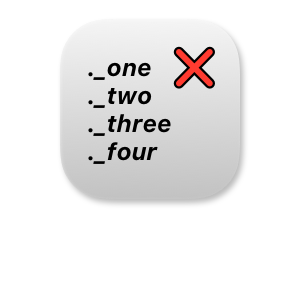
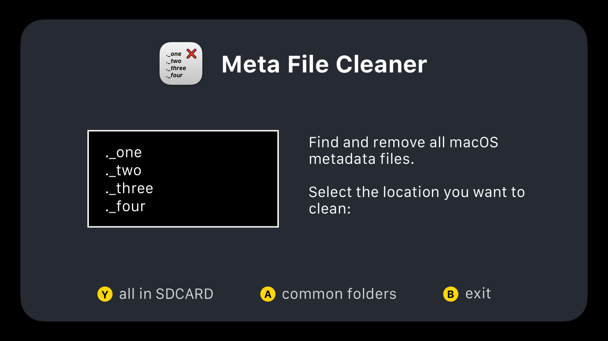

# macOS meta file cleaner

Find and remove all files starting with "._*" from the SD card.

## Compatible

- [x] CrossMix OS `2025-02-25`

## Usage

1. Download this.
2. Put **MetaCleaner** into folder `/SDCARD/Apps/`
3. Reboot device, you will see this app appears in the app list, open it.
4. Press <kbd>A</kbd> to find any file that name starts with `._`. Press <kbd>A</kbd> again will delete all of them.
